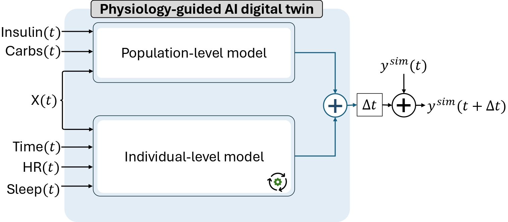
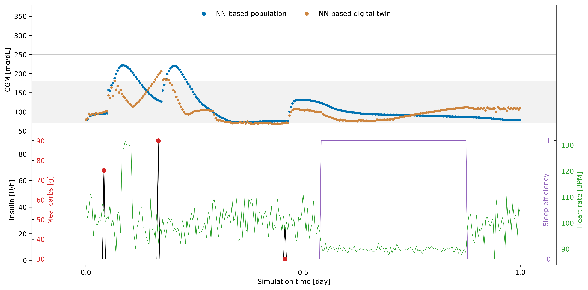

# T1DSim_AI


-----

## Physiologically-constrained Neural Network Digital Twin Framework for Replicating Glucose Dynamics in Type 1 Diabetes

Valentina Roquemen-Echeverri, Taisa Kushner, Peter G. Jacobs, and Clara Mosquera-Lopez

This repository contains a framework to create  physiologically-constrained neural network (NN) digital  twins for simulating glucose dynamics in type 1 diabetes (T1D).

This framework provides a new tool for individualized  in-silico pre-clinical testing of new technologies and  treatment strategies for T1D management.

Read More: [TODO: Add paper](https://github.com/mosqueralopez/T1DSim_AI)



## Table of Contents


- [Installation](#installation)
- [Simulation](#simulation)
- [Creation of a Digital Twin](#creation-of-a-digital-twin)
- [Citation](#citation)
- [License](#license)


## Installation

```console
pip install t1dsim-ai
```

## Simulation

This work presents a novel framework for constructing physiologically-constrained NN digital twins that can replicate the glucose dynamics of individuals with T1D. We developed a novel NN state-space model architecture that allows for observability and interpretability of simulation outputs. This model adheres to known glucose-insulin dynamics as verified by our conformance verification analysis. When augmented with individual-level data, the resulting adaptive digital twin models can capture both inter- and intra-individual variability and incorporate various factors influencing glucose response, such as sleep and physical activity, leading to improved simulation accuracy when compared to ODE-based digital twins.

Run the following command to simulate one day of the digital twin #1.

```bash
python example/runDigitalTwin.py
```

After running the example, the simulation will look as follows:



## Creation of a Digital Twin

WIP

## Citation

If you used this package in your research, please cite it:

```
@Misc{,
    author = {Valentina Roquemen-Echeverri and Clara Mosquera-Lopez},
    title = {T1DSim AI},
    year = {2024--},
    url = "https://github.com/mosqueralopez/T1DSim_AI"
}
```
