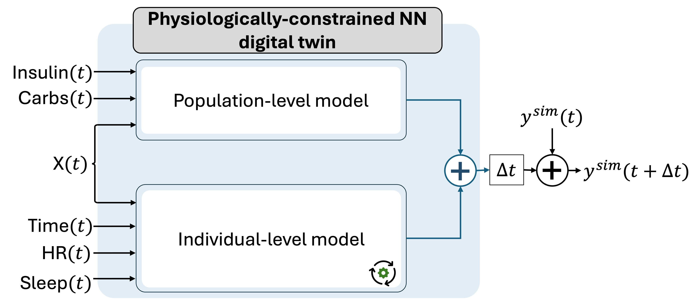

# T1DSim_AI
A Physiology-guided Artificial Intelligence Digital Twin Framework for Replicating Glucose Dynamics in Type 1 Diabetes

Valentina Roquemen-Echeverri, Taisa Kushner, Peter G. Jacobs, and Clara Mosquera-Lopez
### Physiology-guided Artificial Intelligence Digital Twin Framework

### Package Requirements

Install the following dependencies:

* python=3.9.13
* torch=1.13.9

### Example of usage

Move to the `src` folder. Run `python runDigitalTwin.py` to test the simulation of one-day scenario for both the population-level model and the digital twin.

